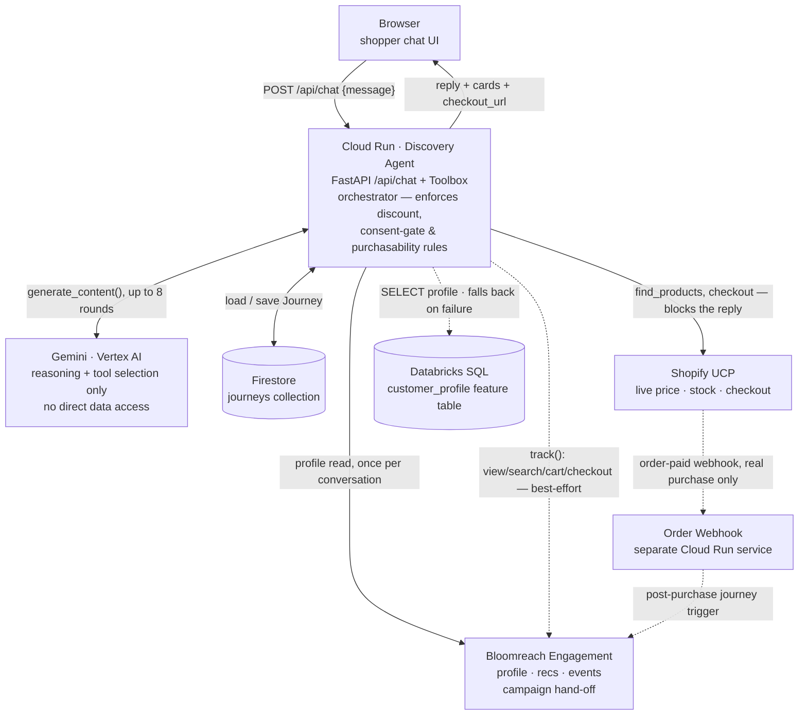

# Team Fourcast: T6 Full Journey Orchestrator

An AI shopping agent for a home-decor store that runs the whole customer journey across four platforms:

| Platform | Role |
|---|---|
| **Google Gemini** (Vertex AI) | Conversation and tool-calling: turns "I need to redo my living room" into room, style, budget and a shortlist |
| **Databricks** | Customer intelligence: predicted LTV, churn risk, value tier and offer eligibility from `fourcast.customer_profile`; paid orders written back to `fourcast.orders` |
| **Bloomreach Engagement** | Profiles, events (view_item, cart_update, checkout, purchase), personalized picks and the post-purchase journey |
| **Shopify** | Live price and stock, checkout, and the order webhook that closes the loop |

## Architecture & data flow

One reasoning agent (Gemini), one execution layer (`Toolbox`, in-process inside the discovery-agent
service, not a separate service), and four external systems it reaches into. Gemini never talks to
Shopify, Bloomreach, Databricks or Firestore directly — every call into those systems originates
from the agent, which is also where the discount/consent/purchasability rules run (never left up
to the model).



**Solid arrows block the reply** (the customer waits on them); **dashed arrows are best-effort or
handled elsewhere** — telemetry writes swallow their own failures, the Databricks read is
feature-flagged and degrades silently, and the order-webhook loop that actually closes a sale into
Bloomreach's post-purchase journey runs in a separate Cloud Run service on Shopify's own schedule,
not this one.

For the full deep-dive — scale/concurrency analysis, retry and caching maps, failure-mode and
blast-radius diagrams, and the business-value math behind the discount logic — ask in the team
channel for the current handbook link.

## Repository layout

```
discovery-agent/   Cloud Run service: Gemini agent + chat UI (app/static/index.html)
order-webhook/     Cloud Run service: Shopify orders -> Bloomreach purchase events + Databricks orders table
bloomreach/        Scenario builder for the agent-requested campaign
stylist-ui/        Standalone copy of the chat UI
enable_databricks.sh  Connects both services to Databricks (token kept in Secret Manager)
```

## Run the tests

```bash
cd discovery-agent && pip install -r requirements-dev.txt && pytest -q
cd ../order-webhook && pip install -r requirements-dev.txt && pytest -q
```

## Deploy (Cloud Shell)

```bash
cd discovery-agent && ./scripts/deploy.sh
cd ../order-webhook && ./scripts/deploy.sh
cd .. && bash enable_databricks.sh
```

Product catalog: `discovery-agent/scripts/gen_catalog.py` generates the 5,000-item Shopify CSV;
`scripts/sync_catalog.py` refreshes the agent's catalog after an import.
